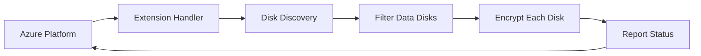

# Confidential Disk Encryption Extension

A cross-platform Azure VM extension for confidential disk encryption, built in Rust.

## Overview

The Confidential Disk Encryption Extension automatically encrypts all data disks attached to an Azure Virtual Machine. It is deployed and managed through Azure (Portal, ARM templates, PowerShell, or Azure CLI) and uses platform-native encryption:

- **Linux**: LUKS2 via `cryptsetup`
- **Windows**: BitLocker via `manage-bde`

## Features

- **Automatic encryption**: All data disks are encrypted when the extension is enabled
- **Cross-platform**: Supports both Linux and Windows VMs
- **Platform-native**: Uses LUKS2 and BitLocker for maximum compatibility
- **Centralized logging**: All operations logged via `tracing` for easy troubleshooting
- **Idempotent**: Safe to run multiple times; already-encrypted disks are skipped

## Installation

The extension is installed via Azure, not directly by users:

### Azure Portal
Navigate to your VM → Extensions → Add → Confidential Disk Encryption

### Azure CLI
```bash
az vm extension set \
  --resource-group myResourceGroup \
  --vm-name myVM \
  --name ConfidentialDiskEncryption \
  --publisher Microsoft.Azure.Security \
  --version 1.0
```

### PowerShell
```powershell
Set-AzVMExtension `
  -ResourceGroupName "myResourceGroup" `
  -VMName "myVM" `
  -Name "ConfidentialDiskEncryption" `
  -Publisher "Microsoft.Azure.Security" `
  -TypeHandlerVersion "1.0"
```

### ARM Template
```json
{
  "type": "Microsoft.Compute/virtualMachines/extensions",
  "name": "[concat(variables('vmName'), '/ConfidentialDiskEncryption')]",
  "apiVersion": "2021-04-01",
  "location": "[resourceGroup().location]",
  "properties": {
    "publisher": "Microsoft.Azure.Security",
    "type": "ConfidentialDiskEncryption",
    "typeHandlerVersion": "1.0",
    "autoUpgradeMinorVersion": true
  }
}
```

## How It Works

1. **Azure deploys the extension** to the VM
2. **Extension discovers** all attached disks
3. **Data disks are identified** (OS disk and removable disks are excluded)
4. **Each data disk is encrypted** using platform-native encryption
5. **Status is reported** back to Azure



## Development

### Prerequisites

- [Rust](https://rustup.rs/) 1.70 or later
- Platform-specific:
  - **Linux**: `cryptsetup` package
  - **Windows**: BitLocker feature enabled

### Building

```bash
cargo build --release
```

### Testing (Dry Run)

The `dry-run` command discovers disks and shows what would be encrypted, without actually performing encryption:

```bash
cargo run -- dry-run
```

### Running Tests

```bash
cargo test
```

## Documentation

For detailed documentation, see the [docs/](docs/README.md) folder:

- [Architecture](docs/design/architecture.md) - System design, components, and data flow
- [Requirements](docs/design/requirements.md) - Functional and non-functional requirements
- [Linux Encryption](docs/design/linux-encryption.md) - LUKS2 and cryptsetup details
- [Development Setup](docs/development/setup.md) - Getting started with development

## Project Structure

```
├── src/
│   ├── main.rs          # Extension entry point
│   ├── lib.rs           # Library root
│   ├── handler.rs       # Azure extension lifecycle handlers
│   ├── logging.rs       # Centralized tracing/logging
│   ├── error.rs         # Error types
│   └── disk/
│       └── mod.rs       # Disk discovery and filtering
├── docs/                # Documentation
│   ├── design/          # Architecture and requirements
│   └── development/     # Development guides
└── tests/               # Integration tests
```

## Log Locations

| Platform | Log Path |
|----------|----------|
| Linux | `/var/log/azure/confidential-disk-encryption/extension.log` |
| Windows | `C:\WindowsAzure\Logs\Plugins\ConfidentialDiskEncryption\extension.log` |

## License

See [LICENSE](LICENSE) for details.

## Contributing

Contributions are welcome! Please see the [development setup guide](docs/development/setup.md) for getting started.
