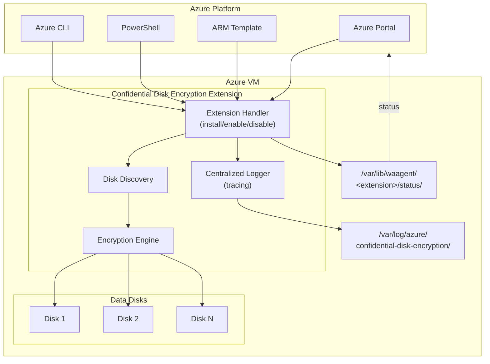
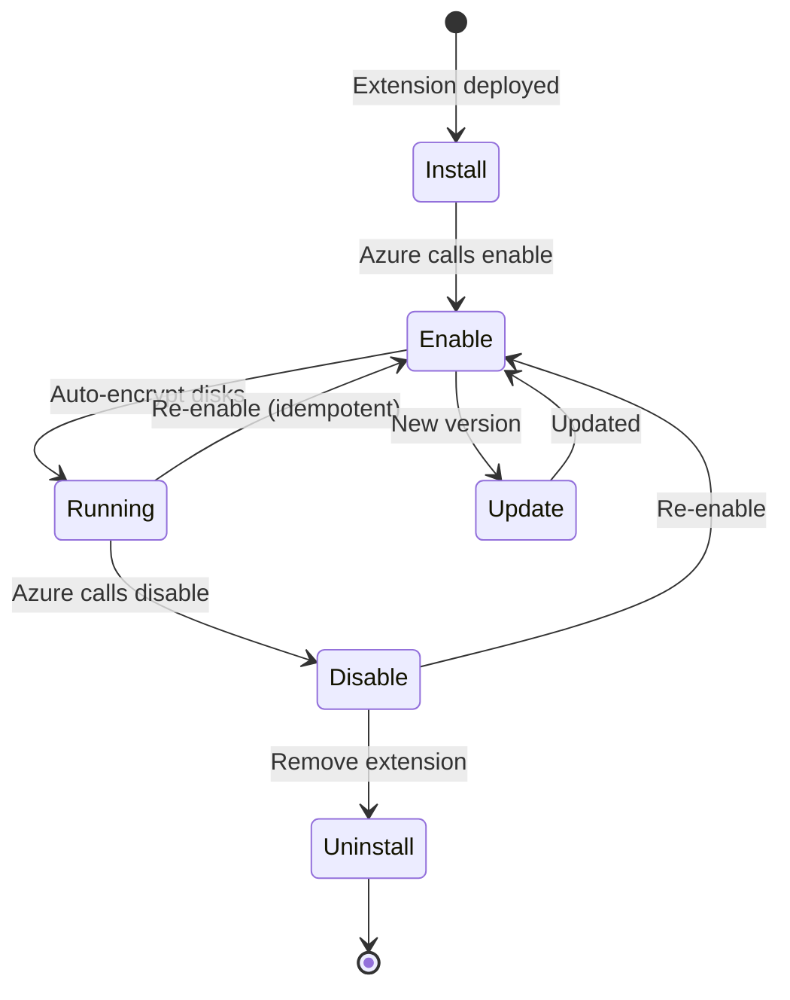
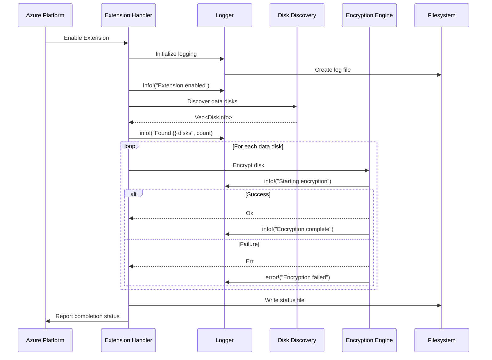

# Architecture

This document describes the high-level architecture of the Confidential Disk Encryption Extension.

## Overview

The Confidential Disk Encryption Extension is an **Azure VM extension** that automatically encrypts all data disks attached to a virtual machine. It is installed and managed through Azure (Portal, ARM templates, PowerShell, or Azure CLI) and runs as a background handler on the VM.



## Extension Lifecycle

Azure VM extensions follow a specific lifecycle. Our extension implements these handlers:



| Handler | When Called | Our Action |
|---------|-------------|------------|
| `install` | Extension first deployed | Initialize directories, validate prerequisites |
| `enable` | Extension enabled | Discover and encrypt all data disks |
| `disable` | Extension disabled | Stop operations (disks remain encrypted) |
| `update` | Extension version updated | Migrate configuration if needed |
| `uninstall` | Extension removed | Cleanup (disks remain encrypted) |

## Components

### 1. Extension Handler (`handler.rs`)

The main entry point that implements the Azure VM extension interface:

- Parses extension configuration from Azure
- Orchestrates disk discovery and encryption
- Reports status back to Azure
- Handles the extension lifecycle (install/enable/disable/update/uninstall)

### 2. Centralized Logger (`logging.rs`)

Uses the `tracing` crate for structured, contextual logging:

- **File output**: `/var/log/azure/confidential-disk-encryption/extension.log`
- **Structured logs**: Key-value pairs for easy parsing
- **Span context**: Tracks which disk/operation is being performed
- **Log levels**: ERROR, WARN, INFO, DEBUG, TRACE

```rust
// Example log output
2024-01-05T16:52:00Z INFO handler: Extension enabled, starting disk encryption
2024-01-05T16:52:01Z INFO discovery: Discovered 3 data disks
2024-01-05T16:52:01Z INFO encrypt{disk=/dev/sdb1}: Starting encryption
2024-01-05T16:52:30Z INFO encrypt{disk=/dev/sdb1}: Encryption complete
2024-01-05T16:52:30Z ERROR encrypt{disk=/dev/sdc1}: Encryption failed error="Device busy"
```

### 3. Disk Module (`disk/`)

Handles disk discovery and filtering:

- **Discovery**: Enumerate all attached disks
- **Filtering**: Identify data disks (exclude OS disk, already encrypted, etc.)
- **Validation**: Check disk is suitable for encryption

### 4. Encryption Module (`encryption/`)

Platform-specific encryption implementations:

- **Linux**: LUKS2 via `cryptsetup`
- **Windows**: BitLocker via `manage-bde`

### 5. Error Handling (`error.rs`)

Centralized error types that integrate with the logger:

- All errors are logged with context
- Errors are reported to Azure via status file
- User-friendly error messages

## Data Flow



## File Locations

| Path | Purpose |
|------|---------|
| `/var/log/azure/confidential-disk-encryption/extension.log` | Operation logs |
| `/var/lib/waagent/<extension>/status/<seq>.status` | Azure status reporting |
| `/var/lib/waagent/<extension>/config/<seq>.settings` | Extension configuration |

## Module Structure

```
src/
├── lib.rs                    # Library root, re-exports
├── handler.rs                # Azure extension handlers
├── logging.rs                # Centralized tracing setup
├── disk/
│   ├── mod.rs               # Disk module root
│   ├── discovery.rs         # Find all disks
│   └── filter.rs            # Filter to data disks only
├── encryption/
│   ├── mod.rs               # Encryption module root
│   ├── provider.rs          # Encryption trait
│   ├── luks.rs              # Linux LUKS2 implementation
│   └── bitlocker.rs         # Windows BitLocker implementation
└── error.rs                 # Error types
```

## Design Principles

### Automatic Operation

The extension requires **no user interaction** after deployment:
- Automatically discovers all data disks
- Encrypts each disk without prompts
- Reports status to Azure for monitoring

### Idempotent Operations

Running `enable` multiple times is safe:
- Already-encrypted disks are skipped
- Operation status is tracked
- No data loss on re-runs

### Centralized Logging

All operations flow through a single logger:
- Consistent log format
- Contextual information (which disk, which operation)
- Easy troubleshooting

### Graceful Error Handling

Errors on one disk don't stop others:
- Each disk is processed independently
- Errors are logged and reported
- Overall status reflects all operations

## Dependencies

| Crate | Purpose |
|-------|---------|
| `sysinfo` | Cross-platform disk discovery |
| `thiserror` | Error type derivation |
| `tracing` | Structured logging |
| `tracing-subscriber` | Log output formatting |
| `tracing-appender` | File-based log output |
| `serde` | Configuration parsing (planned) |
| `serde_json` | JSON status files (planned) |

## References

- [Azure VM Extensions Overview](https://docs.microsoft.com/azure/virtual-machines/extensions/overview)
- [Linux VM Extension Authoring](https://docs.microsoft.com/azure/virtual-machines/extensions/custom-script-linux)
- [tracing crate documentation](https://docs.rs/tracing)
- [LUKS2 Specification](https://gitlab.com/cryptsetup/cryptsetup)
