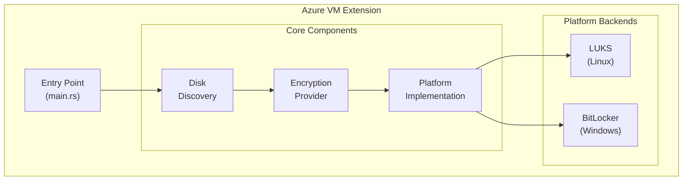
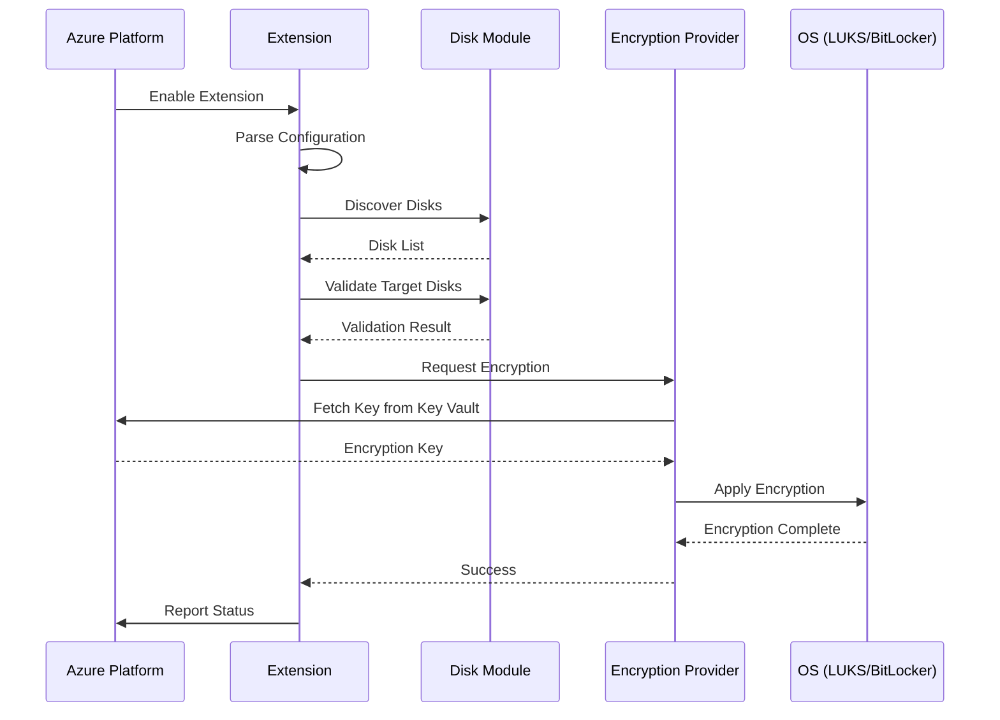

# Architecture

This document describes the high-level architecture of the Confidential Disk Encryption Extension.

## Overview

The Confidential Disk Encryption Extension is a cross-platform tool that runs as an Azure VM extension. It provides disk encryption capabilities for both Linux and Windows virtual machines using platform-native encryption technologies.



## Components

### 1. CLI / Entry Point (`main.rs`)

The command-line interface that serves as the entry point for the extension. Responsibilities:

- Parse command-line arguments
- Initialize logging
- Orchestrate operations by calling library functions
- Report status back to Azure

### 2. Disk Module (`disk/`)

Handles all disk-related operations:

- **Discovery**: Enumerate available disks on the system
- **Validation**: Check if a disk is suitable for encryption
- **Information**: Retrieve disk metadata (size, filesystem, mount point)

### 3. Error Handling (`error.rs`)

Centralized error types for the project:

- Custom error enum covering all failure modes
- Integration with Rust's `std::error::Error` trait
- User-friendly error messages

## Design Principles

### Cross-Platform Abstraction

The code uses Rust's conditional compilation (`#[cfg(target_os = "...")]`) to provide platform-specific implementations while maintaining a unified API.

```rust
// Example pattern for platform abstraction
pub trait DiskOperations {
    fn list_disks(&self) -> Result<Vec<DiskInfo>, Error>;
    fn get_disk_info(&self, path: &str) -> Result<DiskInfo, Error>;
}

#[cfg(target_os = "linux")]
mod linux;

#[cfg(target_os = "windows")]
mod windows;
```

### Modular Structure

Each component is a separate module that can be:
- Developed independently
- Tested in isolation
- Replaced or extended without affecting other components

### Error Propagation

All fallible operations return `Result<T, Error>` using a project-specific error type. This ensures:
- Consistent error handling throughout the codebase
- Clear error messages for users
- Proper error context propagation

## Future Components (Planned)

These components will be added as the project evolves:

### Encryption Module (`encryption/`)

- Abstract encryption provider interface
- LUKS implementation for Linux
- BitLocker implementation for Windows
- Key management integration

### Azure Integration (`azure/`)

- Extension handler implementation
- Configuration parsing
- Status reporting to Azure
- Integration with Azure Key Vault

## Data Flow



### Steps

1. **Initialization**: Extension starts, parses configuration from Azure
2. **Discovery**: Enumerate disks, identify targets for encryption
3. **Validation**: Verify disks meet requirements (not already encrypted, correct type, etc.)
4. **Key Retrieval**: Fetch encryption key from Azure Key Vault
5. **Encryption**: Apply encryption using platform-native tools (LUKS/BitLocker)
6. **Reporting**: Report status back to Azure

## Dependencies

| Crate | Purpose |
|-------|---------|
| `sysinfo` | Cross-platform system/disk information |
| `thiserror` | Derive macro for error types (planned) |
| `clap` | Command-line argument parsing (planned) |
| `tracing` | Structured logging (planned) |

## References

- [Azure VM Extensions Overview](https://docs.microsoft.com/azure/virtual-machines/extensions/overview)
- [LUKS Documentation](https://gitlab.com/cryptsetup/cryptsetup)
- [BitLocker Documentation](https://docs.microsoft.com/windows/security/information-protection/bitlocker/bitlocker-overview)
