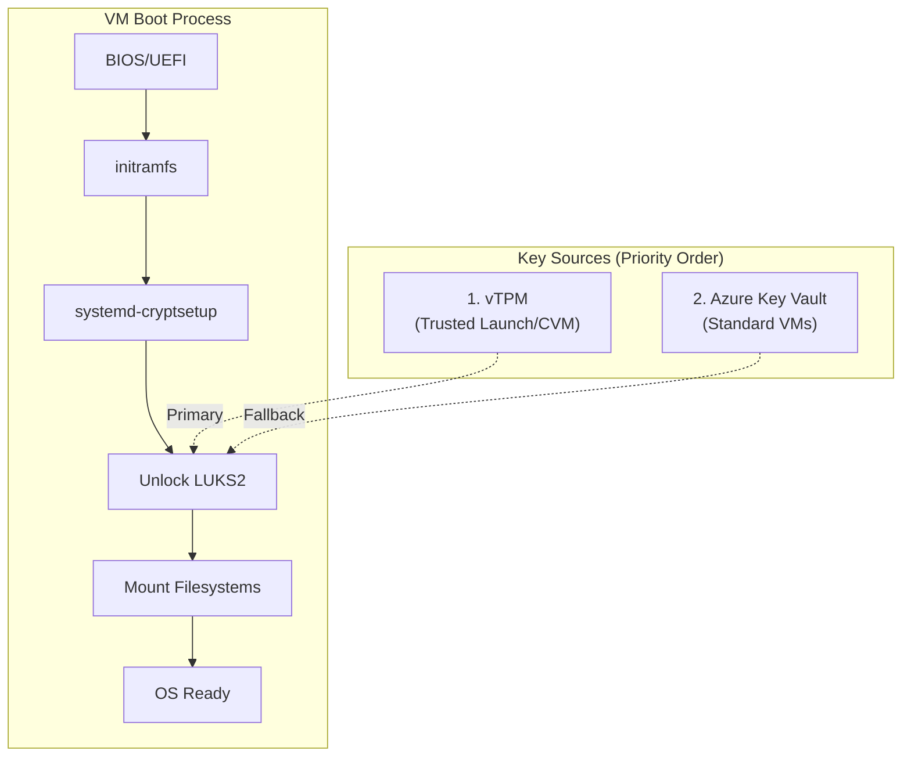
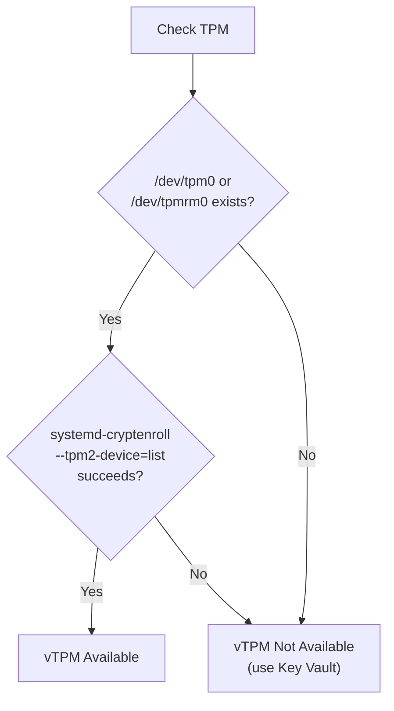
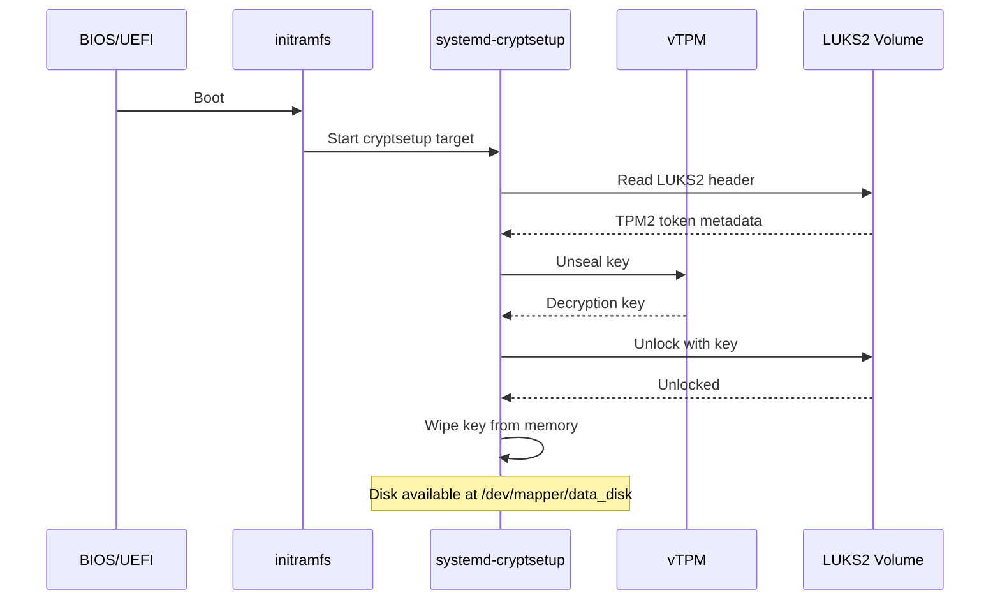
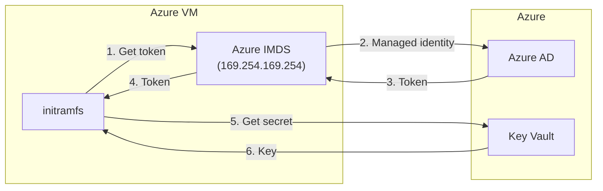

# Boot-Time Disk Unlock Design

This document describes how encrypted data disks are automatically unlocked at boot time, without requiring manual intervention.

## Overview

After the extension encrypts a data disk with LUKS2, the disk needs to be unlocked at every boot. Since Azure VMs may not have console access and need to support automated scaling, we need a fully automatic unlock mechanism.



## Unlock Methods

### Method 1: vTPM with systemd-cryptenroll (Recommended)

**Supported on**: Trusted Launch VMs, Confidential VMs (any Azure VM with vTPM enabled)

The encryption key is **sealed to the TPM**. At boot, systemd automatically retrieves the key from the TPM to unlock the disk. The key never leaves the TPM in plaintext.

#### How It Works

1. **During encryption**: Key is sealed to TPM with `systemd-cryptenroll`
2. **At boot**: systemd's `systemd-cryptsetup` generator reads TPM token from LUKS2 header
3. **Unlock**: Key is unsealed from TPM, disk unlocked, key wiped from memory

#### Advantages

- ✅ Zero network dependency at boot
- ✅ Key never exists in plaintext outside TPM
- ✅ Works even if network is unavailable
- ✅ Integrated with systemd (no custom scripts)

#### Requirements

- vTPM enabled on the VM (Trusted Launch or Confidential VM)
- systemd 248+ with TPM2 support
- `tpm2-tss` libraries installed

### Method 2: Azure Key Vault (Fallback)

**Supported on**: All Azure VMs

For VMs without vTPM, the encryption key is stored in Azure Key Vault and fetched at boot via a custom initramfs hook.

#### How It Works

1. **During encryption**: Key is generated and stored in Azure Key Vault
2. **At boot**: initramfs hook uses Azure IMDS to authenticate and fetch key
3. **Unlock**: Key is used to unlock disk, then securely wiped

#### Advantages

- ✅ Works on any Azure VM
- ✅ Centralized key management
- ✅ Key access can be audited

#### Disadvantages

- ⚠️ Requires network access at boot
- ⚠️ Key exists in memory briefly
- ⚠️ Custom initramfs hook required

## TPM-Based Unlock (Detailed)

### Detecting vTPM Availability



#### Linux Detection

```bash
# Check for TPM device
if [ -c /dev/tpm0 ] || [ -c /dev/tpmrm0 ]; then
    echo "TPM device found"
fi

# Verify systemd-cryptenroll TPM2 support
if systemd-cryptenroll --tpm2-device=list 2>/dev/null; then
    echo "TPM2 support available"
fi
```

#### Rust Detection

```rust
use std::path::Path;
use std::process::Command;

pub fn tpm_available() -> bool {
    // Check for TPM device
    let device_exists = Path::new("/dev/tpm0").exists() 
        || Path::new("/dev/tpmrm0").exists();
    
    if !device_exists {
        return false;
    }
    
    // Verify systemd-cryptenroll can see the TPM
    Command::new("systemd-cryptenroll")
        .args(["--tpm2-device=list"])
        .output()
        .map(|o| o.status.success())
        .unwrap_or(false)
}
```

### Enrolling TPM Key

After formatting a disk with LUKS2, we enroll a TPM-sealed key:

```bash
# Step 1: Format with LUKS2 (already done by encryption module)
cryptsetup luksFormat --type luks2 /dev/sdb1

# Step 2: Enroll TPM2 token
systemd-cryptenroll --tpm2-device=auto /dev/sdb1
```

The `--tpm2-device=auto` flag:
- Automatically detects the TPM device
- Generates a random key
- Seals it to the TPM
- Stores the TPM token in the LUKS2 header

#### PCR Binding (Optional Security Enhancement)

Platform Configuration Registers (PCRs) can be used to bind the key to a specific boot state:

```bash
# Bind to PCRs 7 (Secure Boot state) and 11 (unified kernel image)
systemd-cryptenroll --tpm2-device=auto --tpm2-pcrs=7+11 /dev/sdb1
```

| PCR | Measures |
|-----|----------|
| 0 | BIOS/UEFI firmware |
| 7 | Secure Boot state |
| 11 | Unified kernel image |
| 14 | shim/MOK |

**Note**: PCR binding adds security but may prevent unlock if firmware/kernel is updated. For Azure VMs, we recommend starting without PCR binding.

### Configuring crypttab

After TPM enrollment, update `/etc/crypttab` to enable auto-unlock:

```
# /etc/crypttab
# <name>    <device>        <keyfile>   <options>
data_disk   /dev/sdb1       -           tpm2-device=auto
```

The `tpm2-device=auto` option tells systemd to use the TPM token from the LUKS2 header.

### Boot Sequence



## Azure Key Vault Fallback (Detailed)

For VMs without vTPM, we fall back to Azure Key Vault.

### Architecture



### Key Storage

During encryption, the key is stored in Azure Key Vault:

```bash
# Generate a 256-bit key
KEY=$(head -c 32 /dev/urandom | base64)

# Store in Key Vault
az keyvault secret set \
    --vault-name my-vault \
    --name disk-key-sdb1 \
    --value "$KEY"
```

### initramfs Hook

A custom hook is added to initramfs to fetch the key at boot:

```bash
#!/bin/bash
# /etc/initramfs-tools/hooks/azure-disk-key

# Get access token via IMDS
TOKEN=$(curl -s -H "Metadata:true" \
    "http://169.254.169.254/metadata/identity/oauth2/token?api-version=2018-02-01&resource=https://vault.azure.net" \
    | jq -r .access_token)

# Fetch key from Key Vault
KEY=$(curl -s -H "Authorization: Bearer $TOKEN" \
    "https://my-vault.vault.azure.net/secrets/disk-key-sdb1?api-version=7.0" \
    | jq -r .value)

# Output key for cryptsetup
echo -n "$KEY"

# Key is automatically wiped when script exits
```

### Requirements

- VM must have a managed identity with Key Vault access
- Network must be available during boot (DHCP in initramfs)
- `curl` and `jq` must be included in initramfs

## Implementation in Extension

### Encryption Flow with Unlock Setup

```rust
pub async fn encrypt_disk_with_unlock(&self, disk: &DiskInfo) -> Result<()> {
    // Step 1: Generate encryption key
    let key = generate_random_key(256);
    
    // Step 2: Format with LUKS2
    self.luks_format(disk, &key)?;
    
    // Step 3: Set up unlock method
    if self.tpm_available() {
        // Primary: TPM enrollment
        self.enroll_tpm(disk)?;
        self.configure_crypttab_tpm(disk)?;
    } else {
        // Fallback: Key Vault
        self.store_key_in_keyvault(disk, &key).await?;
        self.install_keyvault_hook(disk)?;
        self.configure_crypttab_keyvault(disk)?;
    }
    
    // Step 4: Update initramfs
    self.update_initramfs()?;
    
    // Step 5: Securely wipe key from memory
    key.zeroize();
    
    Ok(())
}
```

### Unlock Method Selection

```rust
pub enum UnlockMethod {
    /// TPM-sealed key via systemd-cryptenroll
    Tpm2,
    /// Key stored in Azure Key Vault
    KeyVault { vault_name: String, secret_name: String },
}

impl UnlockMethod {
    pub fn detect() -> Self {
        if tpm_available() && systemd_cryptenroll_available() {
            UnlockMethod::Tpm2
        } else {
            UnlockMethod::KeyVault {
                vault_name: get_configured_vault(),
                secret_name: generate_secret_name(),
            }
        }
    }
}
```

## Summary

| Feature | TPM Method | Key Vault Method |
|---------|------------|------------------|
| **VMs Supported** | Trusted Launch, Confidential | All Azure VMs |
| **Network at Boot** | Not required | Required |
| **Key Storage** | Sealed in TPM | Azure Key Vault |
| **Key in Memory** | Never (unsealed directly to LUKS) | Brief (during unlock) |
| **Dependencies** | systemd 248+, tpm2-tss | curl, jq, network in initramfs |
| **Complexity** | Low (systemd handles it) | Medium (custom hook) |

## Recommendations

1. **Default to TPM** when available - it's simpler and more secure
2. **Require Trusted Launch** for new deployments if possible
3. **Key Vault fallback** only for legacy/standard VMs
4. **No PCR binding initially** - can be added later for higher security
5. **Always update initramfs** after configuration changes

## References

- [systemd-cryptenroll man page](https://www.freedesktop.org/software/systemd/man/systemd-cryptenroll.html)
- [LUKS2 Token Specification](https://gitlab.com/cryptsetup/cryptsetup/-/wikis/LUKS2-Format)
- [Azure Trusted Launch](https://docs.microsoft.com/azure/virtual-machines/trusted-launch)
- [Azure IMDS](https://docs.microsoft.com/azure/virtual-machines/instance-metadata-service)
