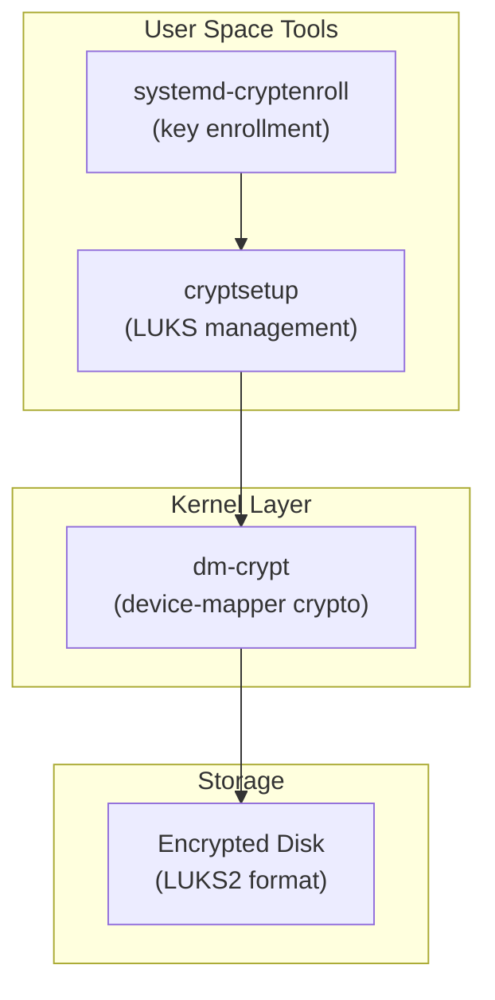
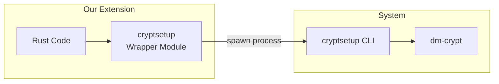

# Linux Disk Encryption Options

This document explores Linux disk encryption options for the Confidential Disk Encryption Extension, with a focus on distro-agnostic solutions.

## Overview

On Linux, disk encryption is typically handled through **dm-crypt**, the kernel's device-mapper crypto target. The user-space tools that interface with dm-crypt are what differ:



## Key Components

### LUKS (Linux Unified Key Setup)

**LUKS is a specification, not a tool.** It defines a standard on-disk format for encrypted volumes that includes:

- Header with metadata (cipher, key slots, etc.)
- Up to 8 key slots for different passphrases/keys
- Standardized format that works across all Linux distros

**Why LUKS?**
- ✅ Distro-agnostic (works on Ubuntu, RHEL, Arch, etc.)
- ✅ Industry standard for Linux disk encryption
- ✅ Supports multiple unlock methods (passphrase, key file, TPM, etc.)
- ✅ Well-documented and widely supported

### cryptsetup

**cryptsetup is the primary CLI tool** for managing LUKS volumes. It's available on virtually all Linux distributions.

```bash
# Create a LUKS encrypted volume
cryptsetup luksFormat /dev/sdb1

# Open (decrypt) a volume
cryptsetup luksOpen /dev/sdb1 my_encrypted_disk

# Close a volume
cryptsetup luksClose my_encrypted_disk

# Add a new key
cryptsetup luksAddKey /dev/sdb1
```

**For our extension**, cryptsetup is the right choice because:
- ✅ Available on all major distros
- ✅ Stable, well-tested API
- ✅ Can be called from Rust via `std::process::Command`
- ✅ Supports all LUKS operations we need

### systemd-cryptenroll

**systemd-cryptenroll** is a newer tool (systemd 248+) specifically for enrolling keys into LUKS2 volumes. It's particularly useful for:

- TPM2 binding (unlock via TPM)
- FIDO2 tokens
- PKCS#11 tokens
- Recovery keys

```bash
# Enroll a TPM2 key
systemd-cryptenroll --tpm2-device=auto /dev/sdb1

# Enroll a recovery key
systemd-cryptenroll --recovery-key /dev/sdb1
```

**Considerations:**
- ⚠️ Requires systemd (not available on non-systemd distros)
- ⚠️ Requires LUKS2 format (not LUKS1)
- ✅ Great for TPM integration
- ✅ Modern, actively developed

## Recommendation for Our Extension

### Primary: cryptsetup + LUKS2

For maximum distro compatibility, we should use **cryptsetup** as our primary interface:



**Implementation approach:**

```rust
// Example: Rust wrapper for cryptsetup
pub struct CryptsetupProvider;

impl CryptsetupProvider {
    /// Format a device with LUKS2
    pub fn luks_format(&self, device: &str, key: &[u8]) -> Result<()> {
        // cryptsetup luksFormat --type luks2 --key-file=- /dev/sdb1
        let mut cmd = Command::new("cryptsetup")
            .args(["luksFormat", "--type", "luks2", "--key-file=-", device])
            .stdin(Stdio::piped())
            .spawn()?;
        
        cmd.stdin.as_mut().unwrap().write_all(key)?;
        let status = cmd.wait()?;
        // ...
    }
    
    /// Open (unlock) a LUKS device
    pub fn luks_open(&self, device: &str, name: &str, key: &[u8]) -> Result<()> {
        // cryptsetup luksOpen --key-file=- /dev/sdb1 my_disk
        // ...
    }
}
```

### Optional: systemd-cryptenroll for TPM

For Azure Confidential VMs with vTPM, we can optionally use **systemd-cryptenroll** when available:

```rust
pub fn enroll_tpm(&self, device: &str) -> Result<()> {
    // Check if systemd-cryptenroll is available
    if !self.has_systemd_cryptenroll() {
        return Err(Error::UnsupportedOperation("TPM enrollment requires systemd"));
    }
    
    // systemd-cryptenroll --tpm2-device=auto /dev/sdb1
    Command::new("systemd-cryptenroll")
        .args(["--tpm2-device=auto", device])
        .status()?;
    // ...
}
```

## Distro Compatibility Matrix

| Distro | cryptsetup | systemd-cryptenroll |
|--------|------------|---------------------|
| Ubuntu 20.04+ | ✅ | ✅ (22.04+) |
| RHEL/CentOS 8+ | ✅ | ✅ |
| Debian 11+ | ✅ | ✅ |
| Fedora | ✅ | ✅ |
| Arch Linux | ✅ | ✅ |
| Alpine | ✅ | ❌ (no systemd) |

✅ = Installed by default or in base repos  
❌ = Not available

## LUKS1 vs LUKS2

| Feature | LUKS1 | LUKS2 |
|---------|-------|-------|
| Key slots | 8 | 32 |
| Token support | ❌ | ✅ |
| Authenticated encryption | ❌ | ✅ |
| Inline integrity | ❌ | ✅ |
| systemd-cryptenroll | ❌ | ✅ |

**Recommendation:** Use LUKS2 for new volumes. It's the default since cryptsetup 2.1 (2019).

## Summary

For our Confidential Disk Encryption Extension:

1. **Use cryptsetup as the primary tool** - it's distro-agnostic and universally available
2. **Target LUKS2 format** - modern, more features, better security
3. **Optionally support systemd-cryptenroll** - for TPM-based unlocking when available
4. **Gracefully degrade** - if advanced features aren't available, fall back to basic cryptsetup

This approach ensures we work on all major Linux distributions while taking advantage of advanced features when available.
